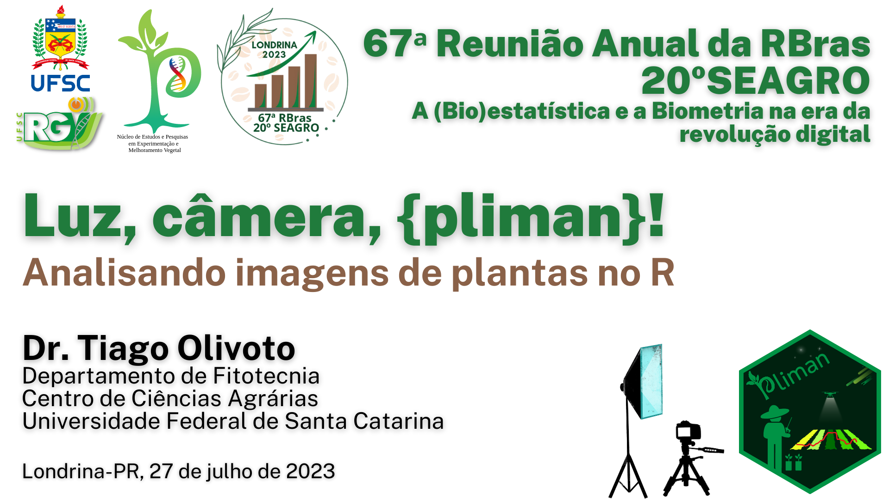

```{r setup, include=FALSE}
knitr::opts_chunk$set(echo = TRUE,
                      error = TRUE,
                      warning = FALSE,
                      message = FALSE,
                      cache = FALSE,
                      fig.align = "center")

```

[](https://67rbras20seagro.com.br/)

# Pacotes

```{r}
library(pliman)
library(tidyverse)
setwd("D:/Desktop/UFSC/cursos/pliman67rbras")
set_wd_here()
# set_pliman_viewer("mapview")

```

# Importação e manipulação
## Importação
```{r}
leaves <- image_import("leaves.jpg", plot = TRUE)

```

## Resolução
```{r eval=FALSE}
dpi(leaves, viewer = "mapview")
```


## Cortar, girar e redimensionar
```{r}
crop <- image_autocrop(leaves, plot = TRUE)
# crop <- image_crop(leaves, viewer = "mapview")

crop <- image_crop(leaves,
                   width = 137:912, 
                   height = 59:739)
```


# Segmentação
```{r}
# Índices para segmentação
pliman_indexes()
index <- image_index(leaves, index = c("R", "G", "B", "B-R"))
plot(index, type = "density")

# Imagem binária
binary <- image_binary(leaves, index = "B-R")
binary <- 
  image_binary(leaves,
               index = "B-R",
               invert = TRUE)
binary <- 
  image_binary(leaves, 
               index = "B-R",
               fill_hull = TRUE)
binary <- 
  image_binary(leaves, 
               index = "B-R",
               filter = 5,
               fill_hull = TRUE)

# Segmentação
seg <- image_segment(leaves,
                     # threshold = 0.1,
                     # threshold = "aa",
                     index = "B-R")
```


# Análise de objetos
## Imagem única
```{r}
grains <- image_import("grains.jpg", plot = TRUE)

# Analisar os objetos
res <- analyze_objects(grains, index = "GRAY")
res$statistics

# Algumas funcionalidades
res <- 
  analyze_objects(grains, 
                  index = "GRAY",
                  lower_noise = 0.4,      # remove ruídos maiores
                  show_contour = FALSE,
                  marker = "point")
plot(res)

res <- 
  analyze_objects(grains, 
                  index = "GRAY",
                  topn_upper = 10,        # Somente os 10 maiores grãos
                  show_contour = FALSE,
                  marker = "point")

```


## Processamento em lote com correção (referência)
### Pelo tamanho da referência
```{r}
# Analisar os objetos
res <- 
  analyze_objects(pattern = "P",
                  dir_original = "flax_grain",    # subpasta com as imagens originais
                  dir_processed = "proc",         # subpasta com as imagens processadas
                  reference = TRUE,               # indica que há uma referência
                  reference_larger = TRUE,        # indica que a referência é o maior objeto 
                  reference_area = 6,             # a referência tem 6 cm2
                  index = "GRAY",
                  show_contour = FALSE,
                  marker = "point",
                  plot = FALSE,
                  save_image = TRUE)

hist(res$results$length)

```


### Pela cor da referência
```{r}
#| out-width: "100%"
flax <- image_import("flax_af/A2_32_3.jpg", plot = TRUE)

# Índice para segmentar a referência e folhas do fundo
image_segment_iter(flax, 
                   index = c("R/(G/B)", "B-R"),
                   ncol = 3)


# Note que agora o processamento é realizado de forma paralela
res <-
  analyze_objects(pattern = "A",
                  dir_original = "flax_af",
                  reference = TRUE,
                  reference_area = 20,
                  watershed = FALSE,
                  filter = 2,
                  plot = FALSE,
                  parallel = TRUE)

merged <- get_measures(res)


# Organizar os dados para ajuste do modelo Logístico
df_plot <- 
  merged$summary |> 
  separate_col(img, 
               into = c("avaliacao", "das", "bloco")) |> 
  mutate(das = as.numeric(das))

formula <- y ~ b1/(1 + exp(b2 - b3 * x))

ggplot(df_plot, aes(das, area_sum)) + 
  geom_smooth(method = "nls",
              method.args = list(formula = formula,
                                 start = c(b1 = 248,
                                           b2 = 6,
                                           b3 = 0.07)),
              se = FALSE,
              color = "red") +
  stat_summary(fun.data = mean_se,
               geom = "errorbar",
               width = 0.5) +
  stat_summary(fun = mean,
               geom = "point",
               col = "blue",
               size = 3) +
  scale_x_continuous(breaks = unique(df_plot$das)) +
  scale_y_continuous(breaks = seq(0, 150, by = 25)) +
  labs(x = "Dias após a semeadura",
       y = expression(Área~foliar~média~(cm^2~planta^{-1}))) +
  theme_bw(base_size = 16) +
  theme(panel.grid = element_blank()) 

```


# Ortomosaicos
Imagens disponibilizadas por Filipe Matias, no github do [FIELDimageR](Rhttps://github.com/OpenDroneMap/FIELDimageR)

## Cobertura vegetal (canopy)

```{r}
# imagem
img <- 
  image_import("potatoes.tif", path = "orthomosaic") |> 
  image_horizontal()

plot(img)

# preparar a imagem
# Somente iterativo
# prep <- image_prepare_mv(img)
prep <- 
  img |> 
  image_rotate(-2.076, plot = FALSE) |> 
  image_crop(width = 194:1075,
             height = 143:379,
             plot = TRUE)


# índice para segmentação
image_index(prep, index =  "HUE")


res <- 
  analyze_objects_shp(prep,
                      nrow = 16,
                      ncol = 9,
                      index = "HUE",
                      object_index = c("NGRDI", "DGCI"))

# cobertura de solo
plot_index_shp(res)

# resumir as informações
results <- get_measures(res)
```

## Índices de vegetação

```{r}
# Nível de parcela
plot_index_shp(res, attribute = "NGRDI")

# Nível de pixel
plot_index(object = res, index = "DGCI")
# plot_index(object = res, index = "DGCI", viewer = "map")

# resumir as informações
results <- get_measures(res)
```

## Stand de plantas

```{r}
# imagem
stand <- image_import("stand.jpg", path = "orthomosaic", plot = TRUE)


# índice para segmentação
image_segment(stand, "HUE")
image_segment(stand, "NGRDI")
image_segment(stand, "NGRDI", invert = TRUE)

res <- 
  analyze_objects_shp(stand,
                      index = "NGRDI",
                      invert = TRUE,
                      nrow = 7,
                      ncol = 1)

par(mfrow = c(1, 2))
# cobertura de solo
plot_index_shp(res)

# mapeamento das plantas (distâncias e CV(%))
object_mark(res)
mapped <-  object_map(res)

# coeficiente de variação dentro da linha
barplot(mapped$cvs)

par(mfrow = c(1, 1))
```


# Fitopatometria
## Iterativa
```{r}
folha <- image_pliman("sev_leaf.jpg", plot = TRUE)
# measure_disease_iter(folha, viewer = "mapview")

```


## Usando paletas
```{r}
folha <- image_import("soybean_rust/soy_1.jpg", plot = TRUE)
pals <- image_import(pattern = "soja_",
                     path = "soybean_rust",
                     plot = TRUE,
                     ncol = 3)
sev <- 
  measure_disease(folha,
                  img_healthy = pals$soja_h.png,     # paleta para folha sadia
                  img_symptoms = pals$soja_s.png,    # paleta para folha doente
                  img_background = pals$soja_b.png)  # paleta para fundo
sev$severity

```

## Usando índices de imagem
```{r}
# Índice para segmentar a folha do fundo, depois a doença da folha
image_segment_iter(folha, 
                   index = c("B", "NGRDI"),
                   ncol = 3)

# IMPORTANTE: theshold vai alterar a severidade
sev2 <- 
  measure_disease(folha,
                  index_lb = "B",            # índice para segmentar a folha do fundo
                  index_dh = "NGRDI",        # índice para segmentar folha doente e sadia
                  threshold = c("Otsu", 0))  # threshold para os dois índices, respectivamente
sev2$severity

# em lote (utilizando as paletas)
sev3 <- 
  measure_disease(pattern = "soy_",
                  dir_original = "soybean_rust",    # pasta com as imagens originais
                  dir_processed = "proc_rust",      # pasta com as imagens processadas
                  save_image = TRUE,
                  plot = FALSE,
                  img_healthy = pals$soja_h.png,
                  img_symptoms = pals$soja_s.png,
                  img_background = pals$soja_b.png,
                  parallel = TRUE)
# standard area diagrams
sad(sev3, n = 6)

sev4 <- 
  measure_disease(pattern = "soy_",
                  dir_original = "soybean_rust",
                  plot = FALSE,
                  index_lb = "B",
                  index_dh = "NGRDI",
                  threshold = c("Otsu", 0),
                  parallel = TRUE)

plot(sev3$severity$symptomatic, sev4$severity$symptomatic)


```

## Em grids

```{r}
folha_grid <- image_import("disease_shp.jpg", plot = TRUE)
sev5 <- 
  measure_disease_shp(folha_grid,
                      index_lb = "HUE2",
                      index_dh = "NGRDI",
                      threshold = c("Otsu", 0),
                      filter = 10,
                      ncol = 3,
                      nrow = 3,
                      plot = FALSE)
plot(folha_grid)
plot(sev5$shapefiles)
plot_measures(sev5, "symptomatic")

```


